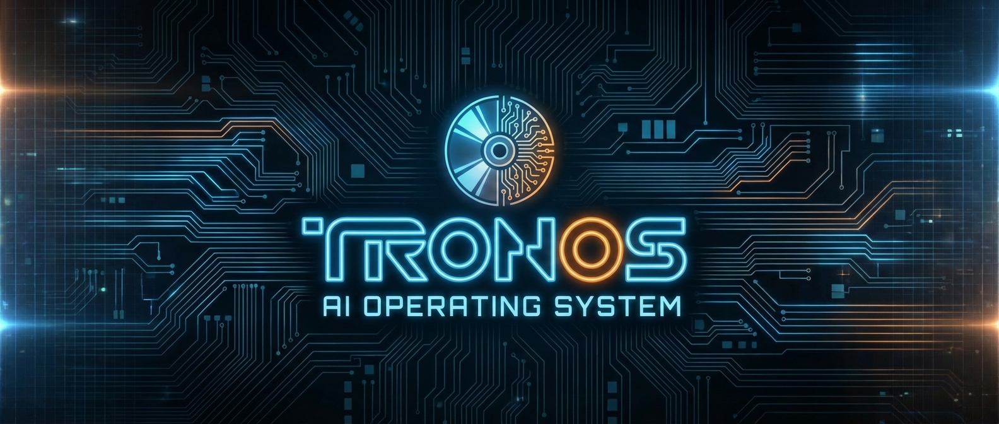

# TronOS - AI-Native Operating System

A browser-based terminal operating system where an LLM serves as the compiler, assistant, and system intelligence. Describe what you want in natural language, and the AI generates executable programs that run natively in the browser.

## Overview

TronOS brings a familiar Linux-like terminal experience to the browser with AI integration at its core. Key principles:

- **Everything is a file** - Standard Unix-like filesystem
- **Everything is modifiable** - Full read/write access to the virtual filesystem
- **LLM is the compiler** - Natural language to executable code
- **Browser is the VM** - No server required, runs entirely client-side

## Features

- Full-featured shell with pipes, redirects, and command chaining
- Virtual filesystem with IndexedDB persistence
- 30+ builtin commands (ls, cd, cat, grep, etc.)
- AI-powered code generation with `@ai` commands
- Multiple session support with tabs
- Dark/light theme support
- Import/export sessions as disk images

## Installation

### Prerequisites

- [Bun](https://bun.sh/) runtime (v1.0+)

### Setup

```bash
# Clone the repository
git clone https://github.com/choas/tronos.git
cd tronos

# Install dependencies
bun install

# Start development server
bun run dev
```

The app will be available at `http://localhost:5173`

## Development

### Available Scripts

```bash
# Start development server with hot reload
bun run dev

# Type check and build for production
bun run build

# Preview production build
bun run preview

# Run tests
bun test

# Run tests with UI
bun run test:ui
```

### Type Checking

```bash
# Run TypeScript type checking
bun run check
```

### Project Structure

```
tronos/
├── src/
│   ├── App.tsx              # Main application component
│   ├── index.tsx            # Entry point
│   ├── engine/              # Shell engine
│   │   ├── shell.ts         # Main shell class
│   │   ├── parser.ts        # Command parser
│   │   ├── executor.ts      # Command execution
│   │   ├── builtins/        # Builtin commands
│   │   └── ai/              # AI integration
│   ├── vfs/                 # Virtual filesystem
│   │   ├── memory.ts        # In-memory VFS
│   │   ├── proc.ts          # /proc filesystem
│   │   └── dev.ts           # /dev filesystem
│   ├── terminal/            # Terminal abstraction
│   ├── persistence/         # IndexedDB persistence
│   ├── stores/              # Solid.js state stores
│   ├── components/          # UI components
│   └── styles/              # CSS styles
├── test/                    # Test files
├── package.json
├── tsconfig.json
├── vite.config.ts
└── vitest.config.ts
```

## Usage

### Basic Commands

```bash
# File operations
ls                    # List files
cd /home/user         # Change directory
cat file.txt          # Display file contents
mkdir mydir           # Create directory
touch file.txt        # Create empty file
rm file.txt           # Remove file

# Text processing
echo "Hello"          # Print text
grep pattern file     # Search in files
head -n 10 file       # First 10 lines
tail -n 10 file       # Last 10 lines
wc file               # Count lines/words/chars

# Environment
env                   # Show environment variables
export VAR=value      # Set variable
unset VAR             # Remove variable

# Shell features
alias ll='ls -la'     # Create alias
history               # Command history
clear                 # Clear screen
help                  # Show help
```

### Pipes and Redirects

```bash
# Pipes
cat file.txt | grep pattern | wc -l

# Output redirect
echo "content" > file.txt
echo "more" >> file.txt

# Input redirect
wc < file.txt

# Command chaining
mkdir test && cd test
command1 || command2
```

### AI Commands (`@ai`)

TronOS integrates AI assistance for code generation and help. Configure your AI provider first:

```bash
# Configure AI provider
config set provider anthropic
config set apiKey sk-...

# Or use the config UI
config ui
```

#### Available AI Modes

```bash
# Create a new executable
@ai create countdown "A countdown timer that takes seconds as argument"

# Edit an existing file
@ai edit /bin/countdown.trx "Add color to the output"

# Explain code
@ai explain /bin/help.trx

# Fix issues
@ai fix /bin/broken.trx "Getting undefined error"

# General questions (chat mode)
@ai How do I create a file in TronOS?
```

### Sessions

TronOS supports multiple independent sessions:

```bash
# List sessions
session list

# Create new session
session new myproject

# Switch session
session switch myproject

# Delete session
session delete old-session

# Rename session
session rename old-name new-name

# Export session to disk image
session export

# Import session from disk image
session import
```

### Keyboard Shortcuts

| Shortcut | Action |
|----------|--------|
| `Ctrl+L` | Clear screen |
| `Ctrl+C` | Cancel current input |
| `Ctrl+D` | Exit (when input empty) |
| `Ctrl+A` | Move to beginning of line |
| `Ctrl+E` | Move to end of line |
| `Ctrl+U` | Delete to beginning of line |
| `Ctrl+K` | Delete to end of line |
| `Tab`    | Autocomplete |
| `Up/Down`| Navigate history |

### Cron Jobs

TronOS has a built-in cron scheduler for running commands on a schedule in the background.

```bash
# Add a cron job (standard cron syntax: min hour dom mon dow)
cron add '*/5 * * * * weather Munich'
cron add '0 9 * * * echo "Good morning!"'

# Shorthands
cron add '@hourly echo "tick"'
cron add '@daily session export'
cron add '@every 5m weather Munich'

# List all jobs
cron list

# Enable/disable a job
cron enable 1
cron disable 1

# View execution history
cron log         # all jobs
cron log 1       # specific job

# Remove a job
cron remove 1
```

#### Editing Cron Jobs

Since TronOS has no text editor, cron supports two editing workflows:

**Interactive editing** - edits each field separately:
```bash
cron edit 1
# Current: */5 * * * * weather Munich
# New schedule [*/5 * * * *]: 0 * * * *
# New command [weather Munich]: weather Berlin
# Updated job 1
```

**Clipboard editing** - copy, modify externally, paste back:
```bash
cron copy 1                # copies "*/5 * * * * weather Munich" to clipboard
# ... modify in an external editor ...
cron paste 1               # replaces job 1 from clipboard
cron paste                 # adds as new job from clipboard
```

#### Virtual Files

Cron jobs are also visible in the virtual filesystem:
```bash
cat /proc/cron/jobs        # crontab-format listing of all jobs
```

### Themes

TronOS supports named theme presets with full hex color customization. Colors are exposed as readable/writable files in `/proc/theme/`.

```bash
# Show current theme
theme

# Apply a preset
theme apply tron
theme apply cyberpunk

# List all presets (built-in + custom)
theme list

# Preview a theme's colors as a swatch in the terminal
theme preview nord

# Change a single color live
theme set accent #ff6600
theme set bg-primary #0a0a2e

# Save current colors as a custom preset
theme save my-theme

# Reset to default dark theme
theme reset

# Legacy toggle (still works)
theme toggle
theme dark
theme light
```

#### Built-in Presets

| Preset | Background | Foreground | Accent | Vibe |
|--------|-----------|------------|--------|------|
| `dark` | `#1e1e1e` | `#d4d4d4` | `#0e639c` | VS Code default |
| `light` | `#ffffff` | `#333333` | `#0066b8` | Clean light |
| `tron` | `#0a0a2e` | `#00ffd5` | `#00b8ff` | Cyan Tron grid |
| `cyberpunk` | `#1a0a2e` | `#ff2a6d` | `#b026ff` | Neon pink/purple |
| `nord` | `#2e3440` | `#d8dee9` | `#88c0d0` | Nordic blue |
| `solarized` | `#002b36` | `#839496` | `#268bd2` | Solarized dark |
| `monokai` | `#272822` | `#f8f8f2` | `#a6e22e` | Sublime green |
| `gruvbox` | `#282828` | `#ebdbb2` | `#fabd2f` | Warm retro |
| `dracula` | `#282a36` | `#f8f8f2` | `#bd93f9` | Purple vampire |

#### Theme Color Keys

Each theme defines these color variables:

| Key | Description |
|-----|-------------|
| `bg-primary` | Main background |
| `fg-primary` | Main foreground text |
| `bg-secondary` | Tab bar, status bar background |
| `fg-secondary` | Dimmed text, labels |
| `accent` | Active tab border, buttons, links |
| `accent-hover` | Hover state for accent |
| `error` | Error messages |
| `border` | Borders and dividers |
| `hover-bg` | Hover backgrounds |

#### /proc/theme Virtual Files

Theme colors are exposed as live readable/writable files:

```bash
# Read the current accent color
cat /proc/theme/colors/accent
#0e639c

# Change a color live (updates CSS instantly)
echo "#ff0000" > /proc/theme/colors/accent

# See what theme is active
cat /proc/theme/active
tron

# Preview a preset's full palette
cat /proc/theme/presets/cyberpunk

# List available presets
ls /proc/theme/presets
```

Custom themes are stored in `/etc/themes/` and loaded on boot.

## Creating Executables

TronOS executables are JavaScript files with a `.trx` extension that follow a specific format:

```javascript
#!/aios
// @name: myprogram
// @description: A description of my program
// @version: 1.0.0
// @author: Your Name

(async function(t) {
  // t.args - command line arguments
  // t.env - environment variables
  // t.cwd - current working directory

  // Output
  t.writeln("Hello, World!");
  t.writeln(t.style.green("Success!"));

  // Filesystem
  const content = await t.fs.read("/home/user/file.txt");
  await t.fs.write("/home/user/output.txt", "content");

  // Sleep
  await t.sleep(1000);  // 1 second

  // Exit
  t.exit(0);
})
```

### Terminal API

Executables receive a `t` (Terminal) object with:

**Output:**
- `t.write(text)` - Write text
- `t.writeln(text)` - Write line
- `t.clear()` - Clear screen

**Styling:**
- `t.style.bold(text)`
- `t.style.red(text)`, `t.style.green(text)`, `t.style.blue(text)`, etc.

**Filesystem:**
- `t.fs.read(path)` - Read file
- `t.fs.write(path, content)` - Write file
- `t.fs.mkdir(path)` - Create directory
- `t.fs.exists(path)` - Check existence

**Network:**
- `t.net.fetch(url, options?)` - Browser fetch (same-origin or CORS-enabled APIs)
- `t.net.proxyFetch(url, options?)` - Proxy fetch for external APIs without CORS

**Control:**
- `t.exit(code)` - Exit with code
- `t.sleep(ms)` - Sleep for milliseconds

## Virtual Filesystem

### Standard Directories

- `/home/user` - User home directory
- `/bin` - Executable files
- `/tmp` - Temporary files
- `/etc` - Configuration files
- `/proc` - System information (virtual)
- `/dev` - Device files (virtual)

### Special Files

**`/proc` (virtual filesystem):**
- `/proc/ai/model` - Current AI model
- `/proc/ai/provider` - Current AI provider
- `/proc/ai/status` - AI configuration status
- `/proc/system/version` - TronOS version
- `/proc/system/uptime` - System uptime
- `/proc/system/memory` - Memory usage
- `/proc/env` - Environment variables
- `/proc/cron/jobs` - Active cron jobs in crontab format
- `/proc/theme/active` - Current theme name
- `/proc/theme/colors/*` - Individual color values (read/write)
- `/proc/theme/presets/*` - Available theme preset definitions

**`/dev`:**
- `/dev/null` - Discards all writes
- `/dev/random` - Random bytes
- `/dev/clipboard` - System clipboard (read/write)

## Configuration

### Environment Variables

TronOS can be configured using environment variables at build time. This is useful for deployment scenarios where you want to pre-configure AI settings.

Create a `.env` or `.env.local` file in the project root:

```bash
# AI Provider (anthropic, openai, ollama, openrouter)
VITE_TRONOS_AI_PROVIDER=anthropic

# API Key for the AI provider
VITE_TRONOS_API_KEY=sk-ant-...

# AI Model (optional, uses provider default if not set)
VITE_TRONOS_AI_MODEL=claude-sonnet-4-6
```

**Note:** Environment variables use the `VITE_` prefix as required by Vite for client-side exposure.

When environment variables are set, they take precedence over localStorage configuration. This allows you to:
- Pre-configure TronOS for deployment
- Set a default API key for all users
- Override the default model or provider

### AI Providers

TronOS supports multiple AI providers:

| Provider | Default Model | Notes |
|----------|---------------|-------|
| `anthropic` | claude-sonnet-4-6 | Recommended |
| `openai` | gpt-4o | OpenAI API |
| `ollama` | llama3.2 | Local, no API key (see [CORS setup](#ollama-cors-setup)) |
| `openrouter` | anthropic/claude-sonnet-4-6 | Multi-provider |

```bash
# View current config
config

# Set provider
config set provider anthropic

# Set API key
config set apiKey sk-ant-...

# Set model
config set model claude-sonnet-4-6

# Set custom endpoint
config set baseURL https://api.example.com

# Reset to defaults
config reset
```

### Ollama CORS Setup

When using Ollama as a provider, TronOS makes requests directly from your browser to `http://localhost:11434`. Because TronOS is served from a different origin (`https://tronos.dev` or `localhost:5173`), Ollama must be configured to allow cross-origin requests.

**Quit the Ollama desktop app first**, then start Ollama from the terminal with the `OLLAMA_ORIGINS` environment variable:

```bash
# Allow TronOS (recommended)
OLLAMA_ORIGINS="https://tronos.dev" ollama serve

# Or allow all origins
OLLAMA_ORIGINS="*" ollama serve
```

> **Important:** The Ollama desktop app auto-restarts if killed via `pkill`. You must quit it from the menu bar icon before running `ollama serve` from the terminal.

**Linux (systemd service):**

```bash
sudo systemctl edit ollama
# Add under [Service]:
#   Environment="OLLAMA_ORIGINS=https://tronos.dev"
sudo systemctl restart ollama
```

Without this, you'll get a 403/CORS error when TronOS tries to reach Ollama.

### Profile Script

Create `/home/user/.profile` to run commands on session start:

```bash
# Set aliases
alias ll='ls -la'
alias ..='cd ..'

# Set environment
export EDITOR=vim

# Welcome message
echo "Welcome to TronOS!"
```

## Technology Stack

- **UI Framework:** [Solid.js](https://www.solidjs.com/)
- **Terminal:** [xterm.js](https://xtermjs.org/)
- **Storage:** IndexedDB via [idb](https://github.com/jakearchibald/idb)
- **Build Tool:** [Vite](https://vitejs.dev/)
- **Testing:** [Vitest](https://vitest.dev/)
- **Language:** TypeScript

## License

Apache 2.0 — see [LICENSE](LICENSE) for details.
